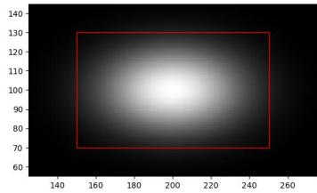

# 3.2.2 多通道语义图像

在目标检测算法 FFTNet[26]中，便通过灰度语义图像构建了高斯椭圆组成的Heatmap 来指示像素属于目标中心点的概率，以及该目标的回归尺度。灰度语义图像的意义是指示某种类别的目标在图像区域的“存在性”，即图像上某区域该类别目标存在的可能性。受此思想启发，对于拥有 item_class_num 个部件类别、图像长宽分别为 width 和height 的样本集，可构建长宽同样为 width 和 height，且具有 item_class_num 个通道的灰度语义图像。动车组转向架上的部件按其位置是否固定可分为固定部件和旋转移动部件两种。这两种部件使用不一致的语义图像构建法。

# 1.固定部件

对于在标准图标注中所有位置固定的部件，通过以下流程构建语义图像：

(1) 初始化一个长宽为 width/8 和 height/8、通道数为 item_class_num、值域为[0, 1]的灰度图像张量，所有像素值都设置为 0.01。之所以长宽设置为八分之一，是为了节省构建语义图像时的内存和显存。  
(2) 遍历标准图标注中的每一个固定部件，根据其边界框生成目标的高斯椭圆二维语义正态分布。以边界框的中心为均值，边界框的半宽和半长为 X 和 Y 方向上的 2倍标准差，生成峰值为 1.0 且 $\times$ 和 Y 相互独立的二维正态分布，即高斯椭圆，该过程如公式(2)到(4)所示：

$$
\left\{ \begin{array} { l l } { \mu _ { \mathrm { x } } = \frac { x _ { m i n } + x _ { m a x } } { 2 } } \\ { \mu _ { \mathrm { y } } = \frac { y _ { m i n } + y _ { m a x } } { 2 } } \\ { \qquad \sigma _ { x } = \frac { \mu _ { \mathrm { x } } - x _ { m i n } } { 2 } } \\ { \qquad \sigma _ { y } = \frac { \mu _ { \mathrm { y } } - y _ { m i n } } { 2 } } \end{array} \right.
$$

$$
x \in [ \mu _ { \mathrm { x } } - 3 \sigma _ { x } , \mu _ { \mathrm { x } } + 3 \sigma _ { x } ] , y \in [ \mu _ { \mathrm { y } } - 3 \sigma _ { y } , \mu _ { \mathrm { y } } + 3 \sigma _ { y } ]
$$

$\mathrm { x _ { m i n } \cdot \mathrm {  ~ \ x _ { m a x } \cdot \mathrm {  ~ \ y _ { m i n } \cdot \mathrm {  ~ \ y _ { m a x } ~ } } } }$ 表示该目标边界框的范围，μ和σ表示正态分布的均值与标准差。对于在语义图像上位置为 $( x , y )$ 的像素，赋值为 SemanticValue $\scriptstyle ( x , y )$ 。每个目标的赋值范围为以μ为中心的 3 倍σ范围。构造高斯椭圆的效果如图 3 所示，图中的红色框即目标的边界框。

  
图 3：通过边界框构建目标的高斯椭圆语义分布

(3) 将每个固定部件的高斯椭圆添加在对应类别通道的灰度语义图像的对应位置上。若同类型目标之间的语义分布区域有重叠，重叠区每个像素都取相对高值。语义分布在具体动车部件图像上的生成如图 4 所示。

  
图 4：同一张标准图像中三种不同的固定部件所生成的高斯椭圆语义分布