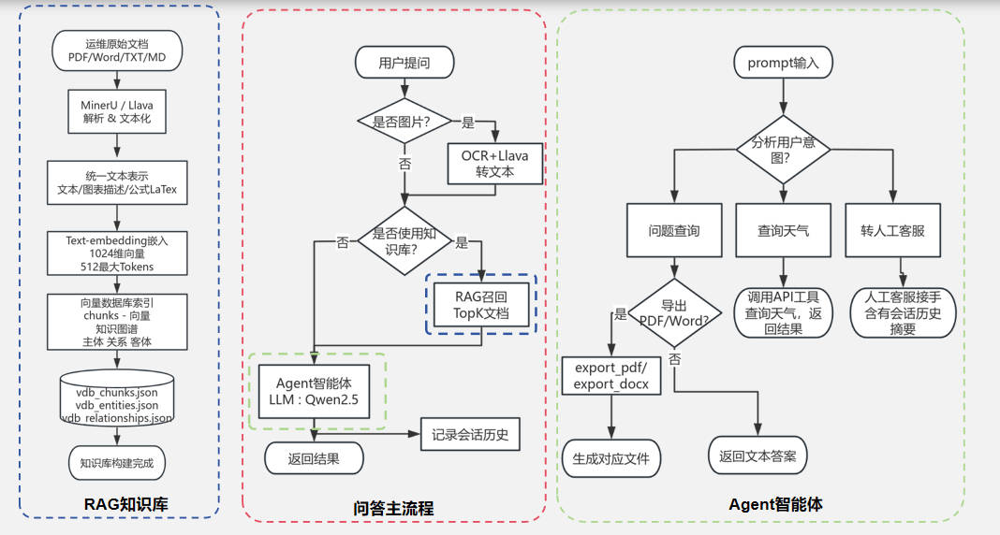
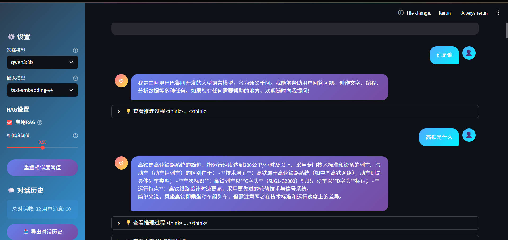
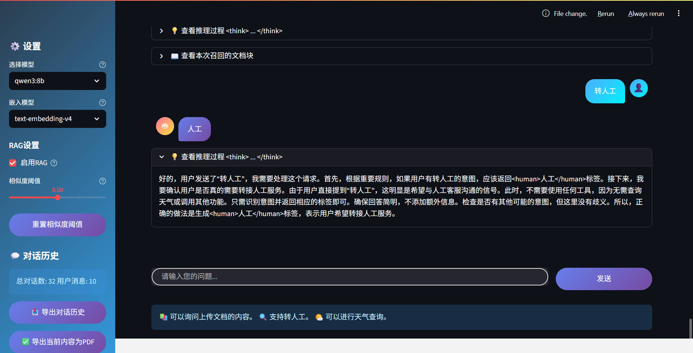
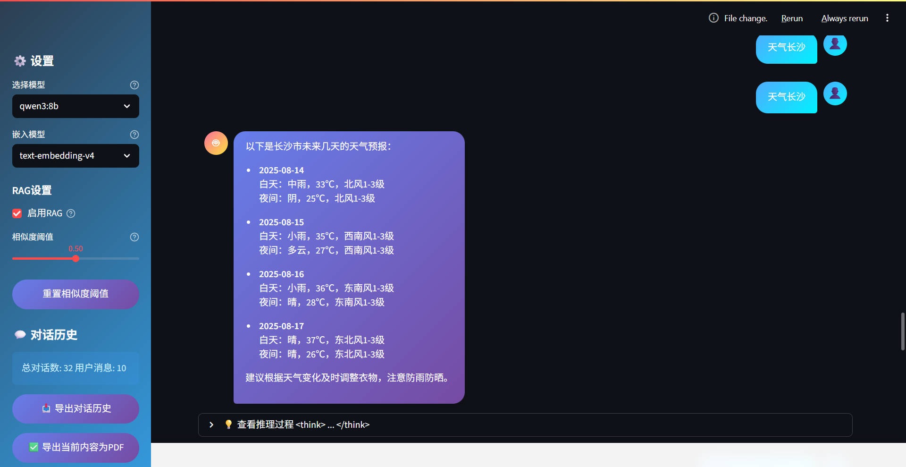
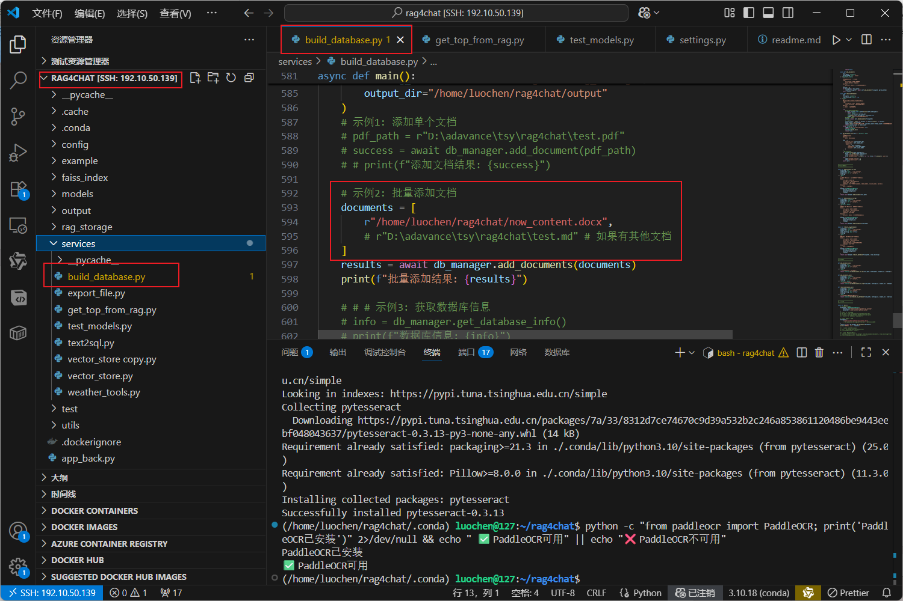
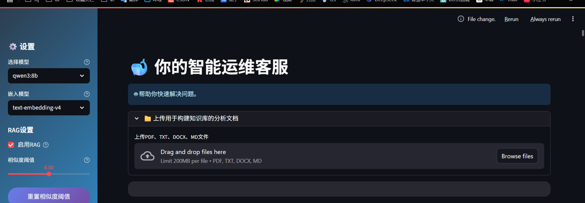

# 你本地的智能客服构建

## 整体框架：


## 前端展示：

### 普通对话：


### 转人工意图识别： 


### 天气查询：  


### 支持文本和图片的对话：  


## 知识库构建

可批量增加文件解析进入知识库，只需要将需要追加的文档放入 `documents` 列表里面就可以了（支持 md、docx、txt、pdf）。  
代码端追加文档到知识库：


网页端追加文档到知识库:


## 代码运行

以下是整理后的 Markdown 内容：

---

## 代码运行

### 克隆代码

```bash
git clone https://github.com/nyzhhd/rag4chat.git
```
```bash
conda create -n myenv python=3.10
```
```bash
cd rag4chat
```

```bash
conda activate myenv
```
### 安装依赖库

```bash
pip install -r requirements.txt
```

### 启动应用

#### 使用 Streamlit 运行（前端 GUI）

```bash
streamlit run app.py --server.port 6006
```

#### 使用 Flask 运行（后端 API 服务）

```bash
python app_api.py
```

##### API 接口说明

- **获取问题答案**:
  ```
  POST http://192.10.220.xxx:19006/v1/chat/completions
  ```

- **检查接口是否可用**:
  ```
  GET http://192.10.220.xxx:19006/health
  ```

##### 前端发送的请求体 (Request Body)

```json
{
  "model": "Qwen3",
  "modelId": "XXXXXX",
  "messages": [
    {
      "chatCode": "1ywj4ox2uvb400",
      "content": "语义图像如何构建",
      "role": "user",
      "msgTime": 1754528942728,
      "contentType": "1",
      "chatFiles": [],
      "chatModelCode": "Qwen3",
      "tokenCount": 0
    }
  ],
  "temperature": 1,
  "isRAG": true,
  "similarity": 0.5,
  "is_summary": false,
  "stream": false,
  "apiKey": "sk-6xxUxxxzA"
}
```

**参数说明**:

| 参数名        | 类型      | 说明                           |
| ------------- | --------- | ------------------------------ |
| `isRAG`       | `boolean` | 是否使用向量知识库             |
| `similarity`  | `float`   | 向量相似度筛选的阈值 (0.0-1.0) |
| `stream`      | `boolean` | 是否使用流式输出               |
| `is_summary`  | `boolean` | 是否对过往会话历史进行总结     |

##### 后端返回的响应体 (Response Body)

```json
{
  "choices": [
    {
      "finish_reason": "stop",
      "index": 0,
      "message": {
        "chatCode": "1ywj4ox2uvb400",
        "content": "您当前的问题表述较为模糊，若需帮助，请明确具体问题内容，例如技术咨询、操作指导或其他需求。我将为您尽力解答！",
        "role": "assistant"
      }
    }
  ],
  "created": 1754556134,
  "human": 0,
  "id": "chatcmpl-1754556134248",
  "model": "qwen3:8b",
  "object": "chat.completion",
  "usage": {
    "completion_tokens": 54,
    "prompt_tokens": 7,
    "total_tokens": 61
  }
}
```

**响应字段说明**:

| 字段名      | 类型     | 说明                                       |
| ----------- | -------- | ------------------------------------------ |
| `chatCode`  | `string` | 本轮会话的 ID，与前端发送的 `chatCode` 一致 |
| `content`   | `string` | 助手返回的内容                             |
| `human`     | `int`    | 用户意图分析结果：0 不转人工，1 转人工     |

---


## 特别感谢
tgltommy : https://www.tgltommy.com/  
RAGAnyThing：https://github.com/HKUDS/RAG-Anything  
Agno: https://github.com/agno-agi/agno